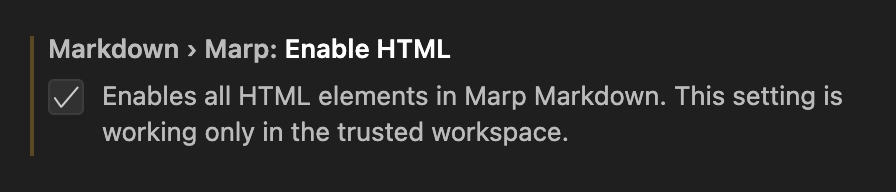

# **Cheatslides**

## Markdown Presentation Ecosystem <!--fit-->

---
# Contents

<div class="columns">
<div style="font-size:1.25em">


- MARP: about & features
- VS Code integration
- Slide file structure
- Examples
- Not covered topics
- Reference links
</div>
<div>

<div style="font-size:1.25em">
Examples
</div>

- Headers & Footers
- Hyperlinks
- Styles
- Images
- Miscellaneous

</div>
</div>

Source <ins>markdown file</ins> and slides are stored [in this repo](https://github.com/vainiusd/marp-cheatslides).

---
## About

### What's Marp?
> Marp (Markdown Presentation Ecosystem) provides a great experience for writing presentations with Markdown.

from [Marp Team Github](https://github.com/marp-team/marp/blob/main/website/docs/introduction/whats-marp.md)


---
## Features

- Write in markdown, present in PDF, PPTX or HTML like this one.
  - Version control
  - Images files separate from slides
- VS Code plugin for live editing & rendering experience.
- CLI or VS Code to export desired format.
- Extend as much as You want or just by writing some HTML.

---
## VS Code integration

Just a copy of official [instructions](https://github.com/marp-team/marp/blob/main/website/docs/introduction/install.md#installing-marp-cli):
1. Install Visual Studio Code.
2. Install the Marp for VS Code extension.
3. Create and open a new Markdown file (with .md extension).
4. Select the Toggle Marp feature for current Markdown command from the Marp icon in editor actions (toolbar).
5. Open VS Code Markdown preview, and start writing your presentation! 

---
## Slide file structure

Minimal slide deck definition (empty slide deck) starts with YAML front-matter and marp enabled:
```yaml
---
marp: true
---
```

---
<!--
_footer: Source: [Marpit markdown](https://marpit.marp.app/markdown?id=marpit-markdown)
-->
## Slide file structure

### Slide separation (ruler)

Default `---` requires empty line before the ruler (according CommonMarks spec)
Other ruler options that work and not require empty lines:
- `___`
- `***`
- `- - -`

---
<!-- 
_footer: "Built-in [themes](https://github.com/marp-team/marp-core/blob/main/themes/README.md)"
-->
## Slide file structure
[Global directives](https://marpit.marp.app/directives?id=global-directives) impact the whole slide deck and are also defined in front matter:
```yaml
---
marp: true
theme: default
style: |
    /* multiline css definitions */
---
```

---
<!--
_backgroundImage: url('./img/custom_background.png')
-->
## Slide file structure
[Local directives](https://marpit.marp.app/directives?id=local-directives-1) can be used in front matter to influence all slides or in a specific slide as a HTML comment (impacts that slide and all subsequent slides).
In order to cheange only that exact slide use local directives prefixed with "_" ([spot direcitve](https://marpit.marp.app/directives?id=apply-to-a-single-page-spot-directives)).
```html
<!--
class: css_name (Specify HTML class of slide’s <section> element.)
backgroundImage: url('./img/custom_background.png')
-->
```

<!--
backgroundColor: 

-->

---

## Slide syntax

### HTML tags

- HTML tags are disabled by default for **security**.
- Allowed by default: `<style>` and `<br />`.
- To enable HTML tags via VS Code togle `markdown.marp.enableHtml` option or go to extension settings:


---
## Examples
### Headers & Footers
<!-- 
header: "Header *text* supports some **markdown** styling, images and hyperlinks"
footer: "Footer *text* also supports some **markdown** styling, images and hyperlinks"
-->

Header set for all subsequent slides or until changed:
```html
<!-- 
header: "Header *text* supports some **markdown** styling, images and hyperlinks"
-->
```
Footer too:
```html
<!-- 
footer: "Footer *text* supports some **markdown** styling, images and hyperlinks"
-->
```

---
<!-- 
_header: "A different header....."
-->

### Headers & Footers

Header set only for this slide. Next slide will have the continuing header or no header if it was not present.
```html
<!-- 
_header: "A different header....."
-->
```

Reverting to no header/footer:
```html
<!-- 
header: ""
footer: ""
-->
```

---
<!-- 
header: ""
footer: ""
paginate: true
-->
<style scoped>
section::after {
  color: darkred;
  font-weight: bold;
  font-size: 2rem;
}
</style>
### Pagination

Just like header and footer, page numbers are available as a local/spot directive:

```html
<!-- 
paginate: true
-->
```

paginate | page number | increment | comment
-|-|-|-|
<b style="color:orange">true</b> | <span style="color:green">Show</span> | <div style="color:red">Yes</div> | Slide number incremented and shown
false | Hide | Yes | Slide number incremented, but not shown
hold | Show | No | Holds the same number for few slides
skip | Hide | No | Unnumbered slide
 

---
<!-- 
_footer: Footer link to [contents](#contents) slide
-->
### Hyperlinks

Links support reference to:
- Text: https://marp.app/
- Markdown: [link](https://marp.app/)
- Slide/heading(h1-6) by slug: slide "[Pagination](#pagination)"
- Slide by number: slide: [#10](#10)
- In footnote<sup>[1][named-link]</sup>

<!--
All links are coverted to <a> tags so You can style them with CSS like this:
a {
    key: value
}  
-->

Markdown and <a href="https://marp.app/"> HTML syntax links </a> work too.

[named-link]: #pagination

---
### Styles

- [Slide](#slide-styles)
- [Text](#text-styles)
- [Code block](#code-block-styles)

---
<!--
_backgroundColor: black
_color: white
-->
### Slide styles
<style scoped>
a:link {
  color: hotpink;
}
a:visited {
  color: lightpink;
}
</style>

Style of this slide is changed with spot directives and some CSS.
```html
<!--
_backgroundColor: black
_color: white
-->
```
<br>
<div style="text-align:center">
Other background directives:
</div>
<br/>
</div>
<div class="columns">
<div>

* backgroundImage ([css explanation][background-image])
* backgroundPosition ([css explanation][background-position])
</div>
<div>

* backgroundRepeat ([css explanation][background-repeat])
* backgroundSize ([css explanation][background-size])
</div>
</div>

<!--
List defined with hyphen comes up at once. Defined with asterics is revealed step by step.
-->


[background-image]: https://www.w3schools.com/cssref/pr_background-image.php
[background-position]: https://www.w3schools.com/cssref/pr_background-position.php
[background-repeat]: https://www.w3schools.com/cssref/pr_background-repeat.php
[background-size]: https://www.w3schools.com/cssref/css3_pr_background-size.php

---
<!--
_class: slide_styles
-->
<style>
    section.slide_styles h3 {
      text-align: center;
    }
    section.slide_styles h4 {
      text-align: right;
      padding-right: 120px;

    }
    section.slide_styles p {
      text-align: left;
      border: 2px solid purple;
      border-radius: 20px;
      padding-top: 50px;
      padding-right: 30px;
      padding-bottom: 50px;
      padding-left: 80px;
    }
</style>
### Slide styles

#### Directive 'class' usage

More experienced with CSS can fully restructure the layout of a slide with the help of `class` directive. It points to CSS definitions inside `style` global directive or `<style>` tag.

With HTML tags enabled and using `<div class="style_name">` it is fairly easy to create Your own layout for the slide as it was done in the previous slide with 2 columns.

---
### Scoped CSS

<style scoped>
pre {
   font-size: 2rem;
}
</style>
Code block font size has been changed with a local style defintion that is valid only in this slide. Keyword **`scoped`** is mandatory. Otherwise all styles of all slides that have the tag are affected.
```html
<style scoped>
pre {
   font-size: 2rem;
}
</style>
```

---
<!--
_header: "Modified header style<br/> spanning muliple lines"
_footer: "Now this is seen better"
 -->
### Footer/header styles
<style scoped>
section {
  padding: 50px;
}

header,
footer {
  position: absolute;
  left: 50px;
  right: 50px;
  height: 20px;
}

header {
  top: 30px;
  font-size: 1rem;
  text-align: center;
  font-family: "Courier New"
}

footer {
  bottom: 30px;
  font-size: 1rem;
  padding-left: 200px;
  color: black;
  font-weight: bold;
}

</style>
Also can easily be modified with some CSS.


---
<style scoped>
li {
  font-family: "Courier New"
}
</style>
### Text styles

A few options:
- __Markdown__ _native_ [features](https://www.markdownguide.org/basic-syntax/).
- Slide (deck) level CSS changes.
```html
<style scoped>
li {
  font-family: "Courier New"
}
</style>
```
- Inline <b>HTML</b> and/or <span style="color:white; background-color: black">CSS</span> features.
```html
- Inline <b>HTML</b> and/or <span style="color:white; background-color: black">CSS</span> features.
```


---
<!--
_footer: "Registered languages: [Marp-core hilightjs instance](https://github.com/marp-team/marp-core/blob/main/src/highlightjs.ts)"
-->
### Code block styles

- Code block syntax highlighting (uses highlight.js)
> All previous code snippets are highlited as HTML comments using **```html** at the begining of the code block

A python highlighting example:
```python
>>> l = [i for i in range(1,8)]
>>> l
[1, 2, 3, 4, 5, 6, 7]
>>> [a**2 for a in l if a%2 == 0]
[4, 16, 36]
```

---
### Code block styles

Custom highlighting inside code blocks is a bit more cubersome, but then You can achieve exactly what You wanted to show with inline HTML tags.

<pre>
<code>>>> <b>l</b> = [i for i in range(<b style="color:darkorange">1,8</b>)]
>>> <b>l</b>
[<b style="color:darkorange">1</b>, <b style="color:crimson;font-style: italic;">2</b>, 3, <b style="color:crimson;font-style: italic;">4</b>, 5, <b style="color:crimson;font-style: italic;">6</b>, <b style="color:darkorange">7</b>]
>>> [<b style="color:cadetblue">a**2</b> for <b style="color:cadetblue">a</b> in <b>l</b> if <b style="color:cadetblue">a%2</b> == 0]
[<b style="color:crimson;font-style: italic;">4, 16, 36</b>]</code>
</pre>

HTML code block definition:
```
<pre>
<code>[...]
[...]
[...]</code>
</pre>
```


---
### Images

- [Background](#background-images)
- [Inline](#inline-images)
- [HTML](#html-img-tag)

---
<!--
_footer: Official slide background **[docs](https://marpit.marp.app/image-syntax?id=slide-backgrounds)**   
-->

### Background images

Keyword `bg` in alt-text of image.
Split the slide into 60% : 40% ratio.
Resized image to 90% of the allocated area.
Syntax: ``


---
<style scoped>
img {
    float: left;
}
div {
    text-align: center;
    border:1px solid #000000
}
h3 {
    text-align: center;
}
</style>
<!-- _footer: "Image source: [marpit.marp.app](https://marpit.marp.app/marpit.png)" -->
### Inline images

Original image in previous slide. Slide and text layout created with simple HTML and CSS. Images inserted with markdwon syntax.

<div>


Keyword `invert`
</div>
<div>


Keyword `blur`
</div>
<div>


Keyword `sepia`
</div>

---
<!--
_footer: 'P.S. Emoji [usage](https://github.com/marp-team/marp-core#emoji-object) and [list](https://www.w3schools.com/charsets/ref_emoji_smileys.asp)'
-->
<style>
    .center-50 {
      display: block;
      margin-left: auto;
      margin-right: auto;
      width: 40%;
    }
</style>
### HTML img tag


Including and positioning the image can also be done this way:

```html

```

As long as You are happy with results &#129395;


---
### Miscellaneous

- [Math](#math-formulas)
- [draw.io](#drawio-iframes)
- [Presenter view comments](#presenter-comments)

---
<!--
_footer: More in [MathJax basic tutorial and quick reference](https://math.meta.stackexchange.com/questions/5020/mathjax-basic-tutorial-and-quick-reference)
-->
### Math formulas

When $a \ne 0$, there are two solutions to $(ax^2 + bx + c = 0)$ and they are 
$$ x = {-b \pm \sqrt{b^2-4ac} \over 2a} $$


---
### draw.io iframes

<iframe frameborder="0" style="width:100%;height:500px;" src="https://viewer.diagrams.net/?target=blank&highlight=000000&edit=_blank&layers=1&nav=1&title=iframed.drawio#R%3Cmxfile%20pages%3D%222%22%3E%3Cdiagram%20id%3D%229brZlhAk52aBHjXjjJcK%22%20name%3D%22GHP%22%3E7VhRd5owFP41PpYjRBAfq1W7c9odz7qzdXuLECFtICwExf36JZAISGutq86t80G43725Ifd%2B9ybQAaMonzKYhLfUR6Rjdf28A646lmV2TVdcJLIuEcdWQMCwr4wq4A7%2FRHqkQjPso7RhyCklHCdN0KNxjDzewCBjdNU0W1DSnDWBAWoBdx4kbfQr9nmoUNMZVIprhINQTe1a%2FVIRQW2sVpKG0KerGgTGHTBilPLyLspHiMjg6biU4ybPaDcPxlDM9xkw%2FnjJfHvy8Di8H4%2B%2FfPCm3yP3wiq9LCHJ1II7lkOEvyEUcMjQokCdH5l8zGHIuYz7pZzFmgSYh9nc8GgkhCXEMc5SX9xGkCUXXoggT0mRvc14cRfI6yeUUD2RGAA1riLF1zr8jGaxj%2BQKTKFehZijuwR6UrsShCseKSJKvaAxVwyS4R0uMCEjSigrfIFJ8RN4wKCPRdS0LqYxqsFXmAkmYRoLVUozmcZhO9gq%2FkvEOMprkAr%2BFNEIcbYWJkrrKh6oQjA1L1Y1WmksrDHK6ikQKioHG9dVtmXUy4S%2FIvl2K%2FnjPKGMFzUm%2Fq4%2F3960MoJ8UR9KFLYhDWgMybhCh1XOukKqbG4oTVSmHhDna5UqmInJnsujae0KvsgO89COFQLVMSALEN9h1yvt5Np2ppIhAjleNnvDm%2BcFnKYoJ3NC54UGx%2BJS0xmReLxJQqRCpqRVv1u2x6xks392lQycA0vZPVYl936HMZokhqIOpk%2FTpU0DLDKaG0Xe3jkFNqn9YxRwWhS445Shc%2BjfIsxsfS8lo1vksgC%2ByQkMFwANXOVqylJa16UZYljECTEN5pjf1%2B5LZ7aSKk9S0I4O30Z6e24j1ltvI2rojOKYV%2BSzBs%2BQT7soF6RG1Y%2BEW47AtqPBlqNyxS1HBUE36zmcs%2F2%2FgbNNvppO%2F%2Fz5uu%2Bx50R8BaBJs438Wr6Klmp0waD6OU2%2F1sAYmG31idjsttg8LTZUgc3EW2L6L%2B%2BHTu%2FlI5F70pebQSsbs2xOcBqeVXfpNruL%2FVJvUW3EPKttzz1RG%2Bm%2FVRuxz7mN6C9fxz7MA5%2FBFaYXeMFg9NRHmhscP%2BpPATzEqaSMHP7ezvpu99x6m2k%2BQZH%2FXW2%2Frubu2dV0HR67rfW3tk7LPrCtOfYLjg5uXEKsvlOX5tXXfjD%2BBQ%3D%3D%3C%2Fdiagram%3E%3Cdiagram%20id%3D%22BuoVyZletQr1XXtBxu0g%22%20name%3D%22IFrame%22%3E7VjbctowEP0aP4bxlZDHcgttk05myEzCo7CFrVa2qCzA9Osr2ytfkAkkzTRpprxgHWlX2j1ndmUbzijOrjlaR7cswNSwzSAznLFh25ZpDeRfjuxLpO8BEHISwKIamJNfWFkCuiEBTlsLBWNUkHUb9FmSYF%2B0MMQ527WXrRht77pGIdaAuY%2Bojj6QQESAWv2remKGSRjB1gP7spyIkVoMkaQRCtiuATkTwxlxxkT5FGcjTPPkqbyUdtMjs9XBOE7EOQZjC81%2BfhWuwyb324Ubfn9Y2BfgZYvoBgIeExRyFMOZxV4lgrNNEuDcl2U4w11EBJ6vkZ%2FP7iT1EotETGF6xRIBXOaBDleE0hGjjBe%2BnGnxk7jcKSDy%2FGouYQluwGPCJaeEJXIqZZs8oUM4MOYCZ0czYVX5lcLELMaC7%2BUSMBgAIyBJSzG0axCssKjBre0CiEBUYeW6zrt8gNQ%2FgwZbo2FKZOJt88Kw%2ByjOsxuKInhzEi8lC10zn6eSN%2FyRiXPsd8ecozEHBB2wgJPgU16O5MinKE2J3058zZLZpsHKacAZEY%2BwMn9e5Ot6HozGGZgVg70aJDK%2Bx%2BagYZUPa7NipOzKo%2BNAq4sHLMnw2Ib7%2BInkqIKNeIjFKfnrrDdY9TpIVRjHFAmybR%2B3i2jY4Y4RGUglKveqLSrHOdBKGSZYNQvsgSPPbTuq6oxyVOZBc1Torgr75VJ0NSmO2Hr%2FX4mNAntSid5bKrG69CgBea%2BlxP7fVaKnKVE2K5q3qSWXT9CwoH0VOFmVvavd0g5ter3eKUfyvMrXx%2B2DXv8t%2B%2BBoEifD%2B%2Bv49tvsB7%2B%2BWWyzL7OOi%2BScypv7R2ZhYL47FvR75B1Khc7CH%2FaAF9bzl%2FSOV%2BwBnt4Djkv5rXrApXmidJ%2FdAy5PNJPX6wGdWdQvxjiTdbp4q6Foj7lOJBxwS1KyVEp9%2Bp22c2f9HnQfkVQiNzlbS5YVe%2BDdv12bjif97PdeV69XA7erXpnPr1dyWH%2FaKDVVfyByJr8B%3C%2Fdiagram%3E%3C%2Fmxfile%3E"></iframe>

---
### Presenter mode and comments
This slide has comments that are shown in presenter view.

Comments are put into HTML comment syntax:
```html
<!-- 
HTML comments are shown in presenter view. 
-->
```

<!-- 
HTML comments are shown in presenter view. 
-->

You can have multiple comments:
```html
<!-- Comment one -->
<!-- Comment two -->
```

<!-- Comment one -->
<!-- Comment two -->

---
## Not covered

- Inline SVG
- Using other (not built-in) themes
- Developing themes
- Transitions

---

## Links

- Online slide editor [web.marp.app](https://web.marp.app/).
- [GitHub Flavored Markdown Spec](https://github.github.com/gfm/) - good reference for markdown syntax for tables, images etc.
- Unified documentation issue in [marp-team github](https://github.com/orgs/marp-team/discussions/126).
- Github topic [marp-themes](https://github.com/topics/marp-themes).
- Color [names](https://developer.mozilla.org/en-US/docs/Web/CSS/named-color) and [code picker](https://www.w3schools.com/colors/colors_picker.asp).


---
### Marp guides

- [Tutorial: Marp for VS Code](https://dev.to/sc0v0ne/tutorial-marp-for-vs-code-5d6k)
- [Write your tech talk slides rapidly with Marp](https://dev.to/andyhaskell/write-your-tech-talk-slides-rapidly-with-marp-2c7g)
- [Markdown to Slides with Marp for VS Code - A Comprehensive Tutorial](https://laravel-school.com/posts/markdown-to-slides-with-marp-for-vs-code-a-comprehensive-tutorial-100/)

---
### Helping answers

- [Center content horizontally](https://stackoverflow.com/questions/47216198/get-marp-to-center-some-content-horizontally-and-vertically)
- [Styling code blocks](https://stackoverflow.com/questions/67012975/how-do-i-style-my-code-blocks-in-a-marp-presentation)
- [How to create full slide size stretched three columns in Marp/Marpit](https://stackoverflow.com/questions/69692460/how-to-create-full-slide-size-stretched-three-columns-in-marp-marpit)
- [Footnote link examples](https://stackoverflow.com/questions/62510648/add-internal-links-to-a-marp-presentation)
- [Directive backgroundImage usage](https://github.com/orgs/marp-team/discussions/67)
- [Naming CSS sections](https://stackoverflow.com/questions/45926475/naming-html-section-ids)
- [Image and text above it](https://stackoverflow.com/questions/69154809/how-to-align-image-below-text-header-in-marp-or-marpit)